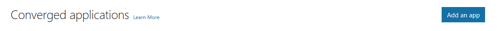
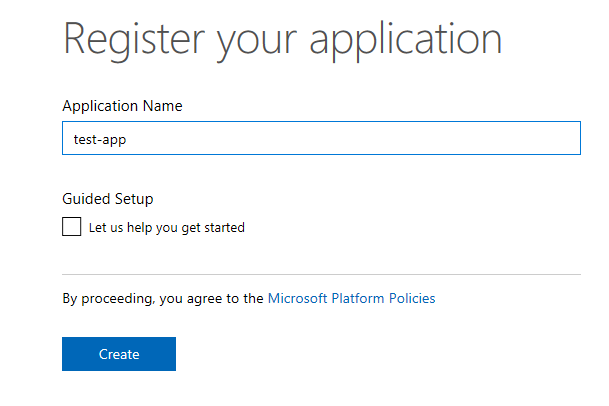
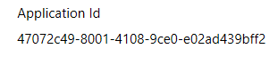
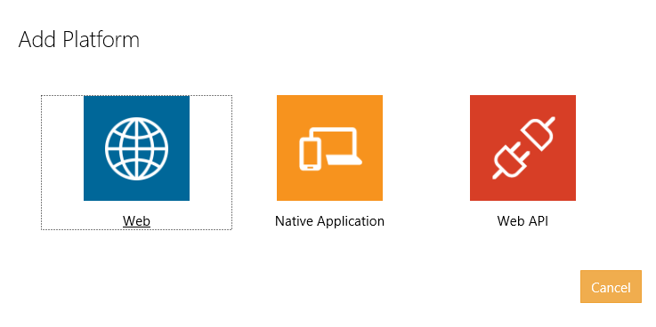
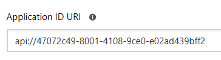
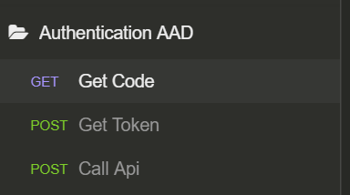
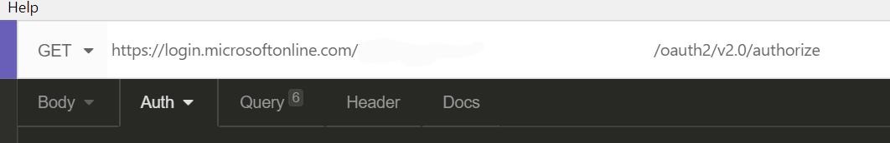
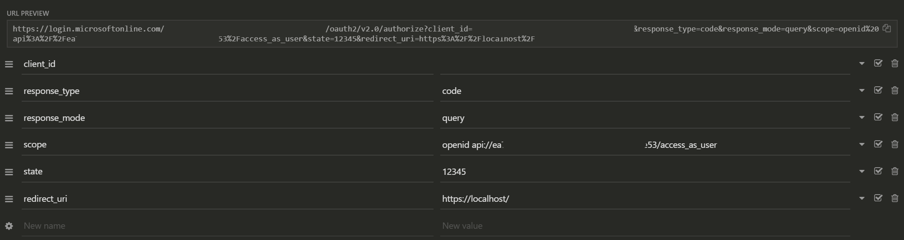
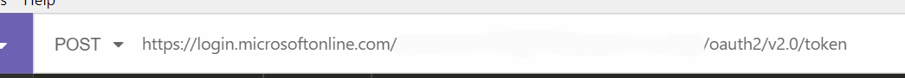
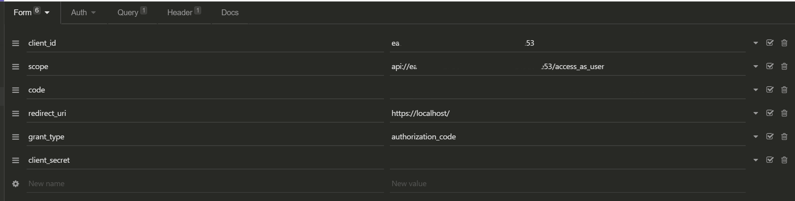

# Policy Manager

A policy manager using Azure Functions and Cosmos DB to manage contextual based resources using policies.

## Getting Started

1. Clone the repository
2. Run the Cosmos DB emulator [download](https://docs.microsoft.com/en-us/azure/cosmos-db/local-emulator)
3. Set the PolicyManager.Setup as the startup project
4. Run the application
5. Set the PolicyManager project as the startup project
6. Hit F5 and see the section below labelled "Example Api Usage"

## Creating an Application using Convergent Applications

First navigate to <https://apps.dev.microsoft.com/>

Select "Add an App"



Enter an "Application Name"



Click on "Create"

Note the "Application Id"



Then click on "Add Platform" and select both "Web" and "Web Api"



In the Redirect URLs, enter something fake like <https://localhost/>

Note the "Application ID Uri" (for below)



This is mainly because your "scopes" below are going to end up being api://47072c49-8001-4108-9ce0-e02ad439bff2/access_as_user

Create a secret - no screenshots here, just go under "Application Secrets" and "Generate New Password", then be sure to save it somewhere.

Lastly, click on "Save" on the bottom.

## Example Api Usage

All requests below require a bearer token that is signed into your application created from above.

Add Policy

POST <http://localhost:7071/api/AddPolicy>

``` json
{
    "category": "Finance",
    "displayName": "Test Policy 01",
    "description": "This is a test policy rule",
    "rule": "if (userName == ""juswen@microsoft.com"") { return ""allow""; } else { return ""deny""; }"
}
```

Update User Policies

POST <http://localhost:7071/api/UpdateUserPolicies>

``` json
{
    "policyIds": [
        "fd84c5f7-f2de-4b3c-a923-ad703178b27a"
    ]
}
```

Fetch Policies

GET <http://localhost:7071/api/FetchPolicies?category=Finance>

Results will look like:

``` json
[
    {
        "id": "fd84c5f7-f2de-4b3c-a923-ad703178b27a",
        "partition": "FINANCE",
        "createdBy": "juswen@microsoft.com",
        "createdDate": "2018-08-28T16:58:43.228285Z",
        "lastModifiedBy": "juswen@microsoft.com",
        "modifiedDate": "2018-08-28T16:58:43.2283878Z",
        "category": "Finance",
        "displayName": "Test Policy 01",
        "description": "This is a test policy rule",
        "rule": "if userName equals 'juswen@microsoft.com' then allow else deny endif"
    }
]
```

Fetch Policy

GET <http://localhost:7071/api/FetchPolicy?category=Finance&id=fd84c5f7-f2de-4b3c-a923-ad703178b27a>

Results will look like:

``` json
{
    "id": "fd84c5f7-f2de-4b3c-a923-ad703178b27a",
    "partition": "FINANCE",
    "createdBy": "juswen@microsoft.com",
    "createdDate": "2018-08-28T16:58:43.228285Z",
    "lastModifiedBy": "juswen@microsoft.com",
    "modifiedDate": "2018-08-28T16:58:43.2283878Z",
    "category": "Finance",
    "displayName": "Test Policy 01",
    "description": "This is a test policy rule",
    "rule": "if userName equals 'juswen@microsoft.com' then allow else deny endif"
}
```

Validate

GET <http://localhost:7071/api/Validate?context=/user/profile>

Still WIP

## Using the Service without a UI

Use something like [Insomnia](https://insomnia.rest/download/)

Create a new application under the [dev center](https://apps.dev.microsoft.com/)

Create a new Folder



For Get Code, configure it like the screens below:



> Set the address bar to an address that has the tenant id like <https://login.microsoftonline.com/[tenant-id]/oauth2/v2.0/authorize>

Then under the Query tab



> In this example, we have the api://{guid}/access_as_user setup as the scope. This is a custom scope built for my app id.

Then we take the address under "URL PREVIEW" and copy and paste it into a browser, then login and consent to app consent.

For the Get Token, configure it like the screens below:



Then under the "Body" tab select "Form URL Encoded" and configure it like the below screenshot:



> The code is from the url redirect from the get code screens in the browser.
>
> The id, secret and redirect url are from the application registration.

Once you click "send" it should give you json output that has a bearer token in it to use to call the api.